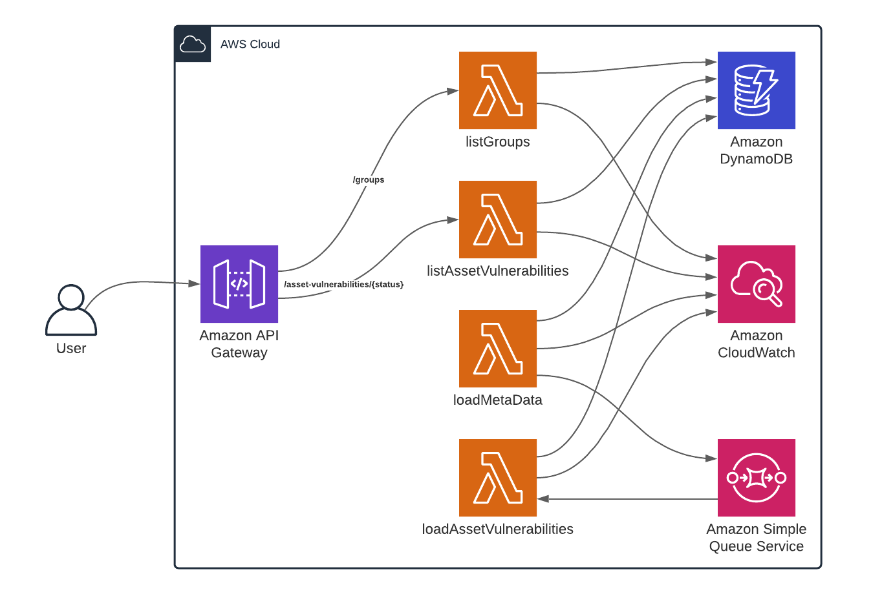

# Serverless Vulnerabilities Manager

## Architecture diagram

## Usage

### Requirements:
* Python 3.5+;
* pip;
* nodejs 14+ (for serverless framework);
* npm
* aws account (for deployment);

### Getting started:
* install nodejs packages: `npm install`;
* install python packages: `pip install -r requirements.txt`;
* start serverless offline: `sls offline`;

At this point everything should be set up. The Api should be available at localhost:3000. 
For example: http://localhost:3000/dev/groups?username=admin@test.com

## Example of usage
##### API:
* `/groups?username=admin@test.com` - get group names for admin user
* `/asset-vulnerabilities/3?username=admin@test.com&group=Williams PLC&asset=101.243.145.6` - get asset vulnerabilities with following filters:
    * status - `3`;
    * username - `admin@test.com`;
    * group - `Williams PLC`;
    * asset - `101.243.145.6`

##### Populate test data:
```
sls invoke local -f loadMetaData -d '{"number_of_av": 150}'
```

### Deployment
```
sls deploy
```

After running deploy, you should see output similar to:

```bash
Serverless: Packaging service...
Serverless: Excluding development dependencies...
Serverless: Creating Stack...
Serverless: Checking Stack create progress...
........
Serverless: Stack create finished...
Serverless: Uploading CloudFormation file to S3...
Serverless: Uploading artifacts...
Serverless: Uploading service aws-python-rest-api.zip file to S3 (711.23 KB)...
Serverless: Validating template...
Serverless: Updating Stack...
Serverless: Checking Stack update progress...
.................................
Serverless: Stack update finished...
Service Information
service: aws-python-rest-api
stage: dev
region: us-east-1
stack: aws-python-rest-api-dev
resources: 12
api keys:
  None
endpoints:
  ANY - https://xxxxxxx.execute-api.us-east-1.amazonaws.com/dev/
functions:
  api: aws-python-rest-api-dev-hello
layers:
  None
```

_Note_: In current form, after deployment, your API is public and can be invoked by anyone. For production deployments, you might want to configure an authorizer. For details on how to do that, refer to [http event docs](https://www.serverless.com/framework/docs/providers/aws/events/apigateway/).
